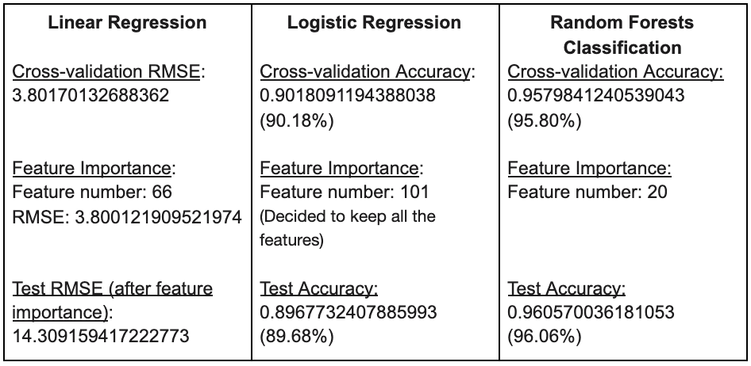
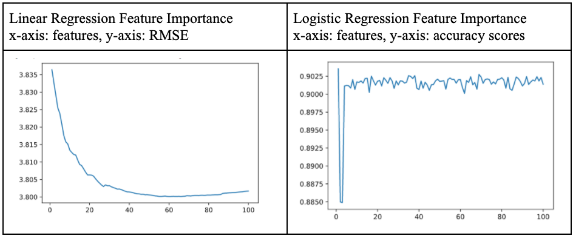
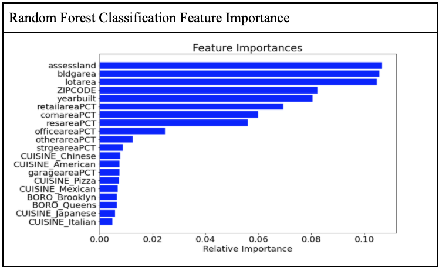
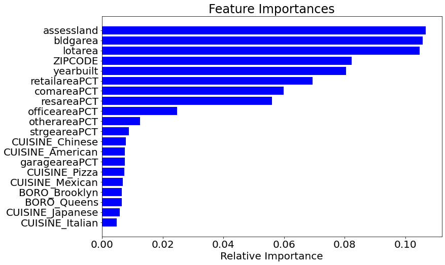

# DETERMINING RESTAURANT INSPECTION GRADES

## CS5304 DATA SCIENCE IN THE WILD
## FINAL PROJECT REPORT
TOBY LEUNG (HTL9), ANGUS LIN (TL799), JESS ROBERT (JAR645), JIANNI HU (JH2585)

---

## ABSTRACT

NYC is home to over 25,000 restaurants spread across a diverse range of cuisines and locations. However, one constant among them is that they must all attain a sanitary inspection grade in order to lawfully operate. There are many ways to lose valuable points that eventually risk a lower inspection grade, therefore, this project aims to examine the qualities that commonly lead to point deductions. In other words, this project will develop a tool that predicts restaurant inspection grades using the input of geographic, economic, and real estate data.

## BACKGROUND
The inspection cycle when boiled down to its basics are actually not as complex as one might think. Similarly to golf, inspections are given higher scores for each violation committed, meaning a lower score is desired. There exists two main point thresholds that separates the restaurants into three tiers; 0-13 points awards the letter grade "A", 14-27 points awards the letter grade "B", and everything above 28 warrants a "C". If one achieves the letter grade "A" on the first attempt, they follow a more off-leash inspection cycle, wherein they would only have to be inspected 11 to 13 months later. For restaurants who do not receive an "A" in their first attempt, they have 7 days to rectify their errors ahead of a "reinspection". At the point of reinspection, they can be reevaluated for any of the three tiers. If they maintain in categories of "B" or "C", their cycles are more restrictive, forcing them to have to be inspected again in the next 3-7 months. Lastly, if a health hazard is found that cannot be corrected immediately or the restaurant is operating without a valid permit, the Department of Health and Mental Hygiene can order the restaurant to cease functioning. This inspection cycle is visually depicted in the graphic above.

To preface the project, we investigated the wealth of relevant work
available to us. One previous study by Akshat Vaghani utilized Yelp's ratings sourced from an API to determine inspection grades. Other studies were seen to use features of zip code and food/cuisine categorization to predict inspection grade. Our study differs from the previous ones as their inconclusive results demonstrates that a simple zip code does not provide enough information to make an accurate prediction. Our project goes one step further to conduct a deeper analysis of the building each restaurant resides in, to generate more unique features that better differentiates each restaurant. That being said, one major takeaway from the previous works was their approach towards data cleaning and methods of dealing with missing data.

## DATASET

To answer the questions of this study, we have to collect data regarding the assessment of different restaurants and the measurements of the area these restaurants are in. Hence, we utilize two datasets in our research and join them together for further analysis.

The first dataset is provided by the Department of Health and Mental Hygiene (DOHMH) in NYC. This dataset, which we called INSPECT, basically records various restaurants\' inspection results in the city. There are more than 400 thousand rows and 26 columns in INSPECT, making the total size of it 163MB. Each row of INSPECT documents an inspection each time of a restaurant, and the columns provide information about the examination, including the inspection data, grade, violation code, etc. The BBL (Borough-Block-Lot) column is highly critical for joining the two datasets because it presents a unique location index.

From the INSPECT dataset, we decided to use these columns in our study: *Inspection date, Grade, Grade Date, Score, Cuisine Description, CAMIS, Violation Code (corresponding with the Violation Description), Violation Description and BBL*.

The main problem we were facing while processing INSPECT is the missing data in the Grade column. The reinspection mechanism causes this circumstance, just mentioned in the Background section. And how we deal with this problem will be explained in the next section.

The second dataset is provided by the Department of City Planning in NYC. This dataset, which we called PLUTO, which stands for Primary Land Use Tax Lot Output, contains extensive land use and geographic data at the city\'s tax lot level. In PLUTO, there are around 850 thousand rows and about 90 fields in each row. The total size is around 360MB. The PLUTO data consists of three basic data types: Tax lot characteristics, Building characteristics, and Geographic/Political/Administrative Districts.

We selected multiple related fields of PLUTO to merge with INSPECT by the BBL: *BBL, Borough, BldgArea(Total Building Floor Area), ComArea (Commercial Floor Area), ResArea (Residential Floor Area), OfficeArea (Office Floor Area), RetailArea (Retail Floor Area), GarageArea (Garage Floor Area), StrgeArea (Storage Floor Area), FactryArea (Factory Floor Area), LotArea, OtherArea (Other Floor Area), YearBuilt, AssessLand (Assessed Land Value), AssessTot (Assessed Total Value)*.

## ANALYSIS & RESULTS

### Data Cleaning

1 - *Drop rows and columns, filter data:* 

> One of our largest hurdles was consolidating the inspection results dataset. Each inspection for each restaurant can have multiple rows (there is a row for each violation during a single inspection). Furthermore, there are several rows that are null in the grade column because if a restaurant did not get an A on the first inspection, they are not graded until the next inspection soon after. We tried several different methods to clean this dataset, with our two best methods being 1.) only using data from inspections conducted in 2019 and 2.) using results from the last 3 inspection dates in recent years (since 2017). Since writing our milestone report, we have found that the second option provides more accurate results and thus used the second method for our final results. The full method we used to clean the INSPECT dataset is the following: firstly, we dropped any rows that did not have grades and also dropped duplicate rows. Then, we filtered for inspections completed on or after 1/1/17. From there, we looked at each restaurant's inspections and selected the 3 most recent, less if there weren't enough inspections for a particular restaurant. With this methodology, we were able to get the most important information we needed (the final inspection grade) for each inspection, and limited the grades associated with each CAMIS (restaurant ID) so that one restaurant with 100 inspection grades would not affect the results significantly more than a restaurant with 1 grade. Additionally, we noticed that there are some lettered grades (\'Z\', \'P\', \'N\', \'G\') not discussed in the official grading criteria but we mentioned earlier in the background part. Since we are looking for letter grades A, B, or C, we filtered out the other grades. After cleaning the INSPECT dataset, we were left with around 100 thousand rows. For the columns, we only extracted 9 columns from a total of 26 columns for the INSPECT dataset. We dropped every other column that is unnecessary for our analysis. The columns we selected were listed above in the background.

> For the PLUTO dataset, we dropped any rows where the year built was 0 or null. In addition, we also dropped rows that had null in the BBL column or where 0 or null were present in the lotarea and bldgarea column. Lastly, we then dropped any rows that still had NA. For the columns, the PLUTO dataset has 90 columns in all, but we only kept 15 relevant columns which are listed in the background section.

2 - *Join data:*

> After eliminating the columns that we planned not to use, we inner joined the pluto dataset with the inspection dataset by BBL so that we had a new dataset with restaurants, their BBLs, their grades, and all the other columns mentioned above.

3  - *Drop, keep, fill in missing data:*

> Given that missing values in the "GRADE" column most likely reflected a failed first inspection, we decided to drop this data as we deemed it not missing, just not relevant since we are looking for the Final inspection grade. These missing items were (MNAR) because as we discussed in the Background section, initial inspections that are below an A are not given a grade at all.

> There is also a row missing all information relating to the inspections, but it has the BBL and CAMIS index. We believe that this data is missing at random and we could not use any filling null methods here. We simply dropped the row.

> As noted in step 1, we dropped missing data in the PLUTO dataset regarding area related features, or where the 'yearbuilt' column has some unusual values (having numbers such as 969 and 115 indicating the year). These data points are MAR and the 3 null filling methods are not useful here given that the features could vary a lot even in the neighboring bbl.

### Implement Algorithms

For our final results, we decided to test logistic regression and random forest classification in addition to linear regression. We split the data into training and holdout sets (80/20 random split). We also performed feature engineering for each of the algorithms to highlight feature importance (as well as grade to number encoding for linear regression). To validate our data, we used cross validation for all of the algorithms.

1.  *Linear regression:*
    > To begin our analysis, we first trained our data on a linear regression model to predict the testing data set. We used feature engineering to select the best features and cross validated the computed RMSE with our predicted results. Additionally, for linear regression, we converted the letter grades to numerical grades, with A: 90, B: 80, and C: 70.

2.  *Logistic Regression:*
    > We also trained our data with multinomial logistic regression to predict test data. We performed feature engineering to select K-best and also computed a cross validation accuracy score. Also for logistic regression, we kept the grades as letter grades.

3.  *Random Forests Classification*:
    > We then also trained our data with random forest to predict testing data. Again, performed feature engineering and used cross validation with accuracy scores. As with logistic regression, we used letter grades.

### Other findings and issues

1.  An issue we came across is that Linear Regression is perhaps not very suitable for our project. Since the output is value based, we have to convert the letter grade into a numerical one Furthermore, we could not compute an accuracy score to compare the results with other studies from linear regression, but we were able to compute an RMSE.

1.  When performing feature engineering for logistic regression, we found that the model is not overfitting regardless of the number of features used. We attributed this to low weights given to the features and thus decided to keep all the features.

## Results

<!-- +----------------------+----------------------+----------------------+
| **Linear             | **Logistic           | **Random Forests     |
| Regression**         | Regression**         | Classification**     |
|                      |                      |                      |
| [Cross-validation    | [Cross-validation    | [Cross-validation    |
| RMSE]{.ul}:          | Accuracy]{.ul}:      | Accuracy:]{.ul}      |
| 3.80170132688362     | 0.9018091194388038   | 0.9579841240539043   |
|                      | (90.18%)             | (95.80%)             |
| [Feature             |                      |                      |
| Importance]{.ul}:    | [Feature             | [Feature             |
|                      | Importance]{.ul}:    | Importance:]{.ul}    |
| Feature number: 66   |                      |                      |
|                      | Feature number: 101  | Feature number: 20   |
| RMSE:                |                      |                      |
| 3.800121909521974    | (Decided to keep all | [Test Accuracy:      |
|                      | the features)        | ]{.                  |
| [Test RMSE (after    |                      | ul}0.960570036181053 |
| feature              | [Test Accuracy:      | (96.06%)             |
| importance)]{.ul}:   | ]{.u                 |                      |
| 14.309159417222773   | l}0.8967732407885993 |                      |
|                      | (89.68%)             |                      |
+----------------------+----------------------+----------------------+ -->

As seen from our results table above, Random Forest Classification has the highest accuracy (\>96%), and thus we used the Random Forests Classification Model to ultimately predict the inspection scores. As mentioned previously, we had to use RMSE for linear regression, and thus we implemented logistic regression and random forest classification in order to better compare our results with other research and test different models. For each of the algorithms we conducted feature engineering to determine feature importance for our models. Below, we have provided 3 plots that output our feature importance results for each of the models. As can be seen from these tables, the linear regression model provided lowest RMSE with the feature number 66. The logistic regression feature importance graph shows that the model is not overfitting, probably because of low weights, and lastly, the random forest classification's feature importance chart shows the 20 features and their relative importance.

<!-- +----------------------------------+----------------------------------+
| Linear Regression Feature        | Logistic Regression Feature      |
| Importance                       | Importance                       |
|                                  |                                  |
| x-axis: features, y-axis: RMSE   | x-axis: features, y-axis:        |
|                                  | accuracy scores                  |
+==================================+==================================+
| {width="3.0677088801399823in" | ng){width="3.0567738407699037in" |
| height="1.8272145669291338in"}   | height="1.8907874015748032in"}   |
+----------------------------------+----------------------------------+ -->

<!-- {width="4.59375in" height="2.552571084864392in"} -->

## FINDINGS & CONCLUSION

Our Random Forest Prediction Model, using property features from each BBL with the borough and cuisine type of restaurants, has allowed us to predict inspection grades at a higher accuracy rate than those achieved by previous studies. This is expected as the features we engineered are better descriptors of the environment that the restaurant is located in. A previous study on the inspection dataset using the Naïve Bayes classification algorithm used only zip code and food type to predict restaurant inspection grades with about 62% accuracy. With the more descriptive features in our model, we could predict with an accuracy of 96%. Furthermore, another research project used the Yelp API, and the study found that there was no direct, clear correlation between inspection grades and Yelp ratings, thus informing us that user ratings were another feature not to focus on in our project. As a result, we were made more confident in using property descriptions to predict the grades. Our high accuracy also makes sense given that most of the inspection grades in our dataset were A's.

Our better results can also be attributed to better training/testing data (see the Data Cleaning section above). When cleaning our data, we limited the amount of grades that could be associated with each restaurant so that there was more consistency on the grade to restaurant ratio. We also better inspected our data, removing rows with null values and excluding data with many outliers (as we saw with the 'scores' attribute). Furthermore, we initially applied only linear regression on each feature and compared the Mean Square Error (MSE) of the prediction based on the regression model trained by that feature. As we learned in our first attempt, the multicollinearity between attributes attributed to linear regression's poor performance. Furthermore, linear regression's dependence on the grades being categorical further makes linear regression unsuitable for this project.

Thus, in order to fix the issues with features, we performed feature engineering to incorporate multiple features into our prediction models. Additionally, as stated earlier, linear regression is not the most suitable algorithm for our project, and thus we implemented logistic regression and random forest, which could both use the grades as letters, with Random Forest Classification being the most accurate algorithm for our data.

---

REFERENCES
==========

**Datasets**
------------

-   [[https://data.cityofnewyork.us/Health/DOHMH-New-York-City-Restaurant-Inspection-Results/43nn-pn8j]{.ul}](https://data.cityofnewyork.us/Health/DOHMH-New-York-City-Restaurant-Inspection-Results/43nn-pn8j)

-   [[https://www1.nyc.gov/site/planning/data-maps/open-data/dwn-pluto-mappluto.page]{.ul}](https://www1.nyc.gov/site/planning/data-maps/open-data/dwn-pluto-mappluto.page)

**Related Works**
-----------------

-   [[http://cs229.stanford.edu/proj2013/Walter-PredictionOfNYCRestaurantHealthInspectionResults%20pdf.pdf]{.ul}](http://cs229.stanford.edu/proj2013/Walter-PredictionOfNYCRestaurantHealthInspectionResults%20pdf.pdf)

-   [[https://bnewborn.github.io/BNewborn.github.io/2018/05/20/NYC-Restaurant-Inspections.html]{.ul}](https://bnewborn.github.io/BNewborn.github.io/2018/05/20/NYC-Restaurant-Inspections.html)

-   [[https://nycdatascience.com/blog/student-works/nyc-restaurants-reviews-and-inspection-scores/]{.ul}](https://nycdatascience.com/blog/student-works/nyc-restaurants-reviews-and-inspection-scores/)

**Academic Papers Regarding Methodologies and Algorithms**
----------------------------------------------------------

-   [[https://www.semanticscholar.org/paper/Consumer-Reviews-and-Regulation%3A-Evidence-from-NYC-Farronato-Zervas/ed1b1279e5d071ff31cf4fad903f181f8db8c2c9?p2df]{.ul}](https://www.semanticscholar.org/paper/Consumer-Reviews-and-Regulation%3A-Evidence-from-NYC-Farronato-Zervas/ed1b1279e5d071ff31cf4fad903f181f8db8c2c9?p2df)

-   [[https://dl.acm.org/doi/pdf/10.5555/2460156.2460186]{.ul}](https://dl.acm.org/doi/pdf/10.5555/2460156.2460186)

-   [[https://www.ncbi.nlm.nih.gov/pmc/articles/PMC2992018/]{.ul}](https://www.ncbi.nlm.nih.gov/pmc/articles/PMC2992018/)

**Scikit Learn Packages Used for Algorithms Implementations**
-------------------------------------------------------------

-   [[https://scikit-learn.org/stable/modules/generated/sklearn.linear_model.LinearRegression.html]{.ul}](https://scikit-learn.org/stable/modules/generated/sklearn.linear_model.LinearRegression.html)

-   [[https://scikit-learn.org/stable/modules/generated/sklearn.linear_model.LogisticRegression.html]{.ul}](https://scikit-learn.org/stable/modules/generated/sklearn.linear_model.LogisticRegression.html)

-   [[https://scikit-learn.org/stable/modules/generated/sklearn.ensemble.RandomForestClassifier.html]{.ul}](https://scikit-learn.org/stable/modules/generated/sklearn.ensemble.RandomForestClassifier.html)

-   [[https://scikit-learn.org/stable/modules/generated/sklearn.feature_selection.SelectKBest.html]{.ul}](https://scikit-learn.org/stable/modules/generated/sklearn.feature_selection.SelectKBest.html)

-   [[https://scikit-learn.org/stable/modules/generated/sklearn.metrics.accuracy_score.html]{.ul}](https://scikit-learn.org/stable/modules/generated/sklearn.metrics.accuracy_score.html)
